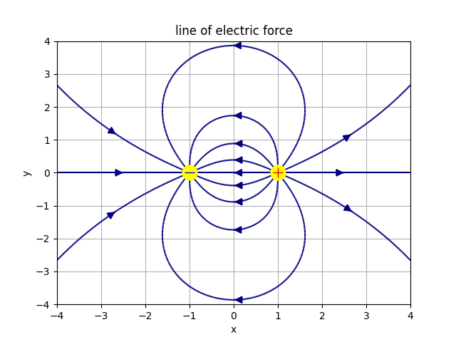

# compute-line-of-electric-force
平面上の点電荷の電気力線をプロットする。
プロットにはPythonのnumpyとmatplotlibを用いている。



## 使用手順
1. リポジトリをクローンする。
1. 依存をインストール
    ```bash
    pip3 install numpy matplotlib
    ```
1. `./plot.py`を実行。

## アルゴリズム
1. 十分な領域のxy平面を十分に細かい領域に分割する。
    今回はx,y軸方向ともに-4~4の、8*8の平面を用意し、300分割した。
1. 点電荷の位置と電荷量を仮定し、各点での電場のx,y成分を計算する。
1. 一方の点電荷から電場ベクトルを数値積分して電気力線の座標を求める。
1. 上記を電気力線の本数分繰り返す。
